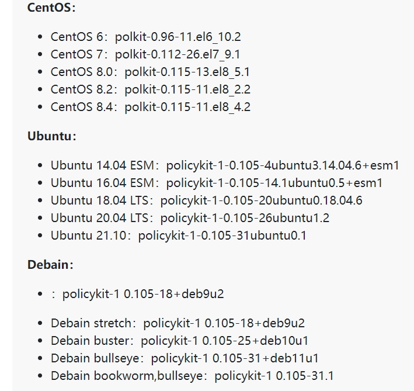
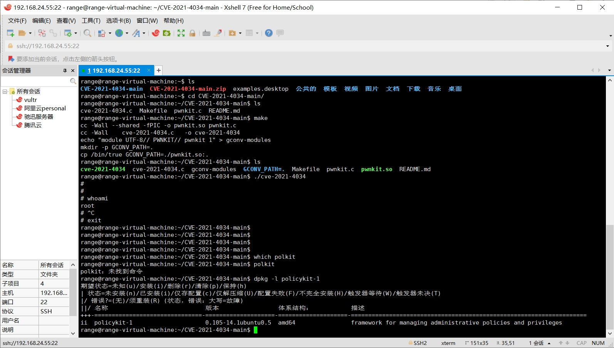
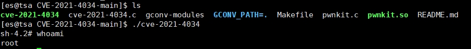

# 概述

Polkit（PolicyKit）是类Unix系统中一个应用程序级别的工具集，通过定义和审核权限规则，实现不同优先级进程间的通讯。pkexec是Polkit开源应用框架的一部分，可以使授权非特权用户根据定义的策略以特权用户的身份执行命令。

该漏洞是由于 `pkexec` 在处理传入参数的逻辑出现问题，导致环境变量被污染，最终交由 `pkexec` 代码逻辑执行实现客户机权限提升。有普通权限用户的攻击者通过执行漏洞文件，触发越界读写，从而在目标系统上造成权限提升。

# 影响范围

未受影响的版本如下



## 版本自查

```bash
rpm -qa polkit 			# CentOS查看命令
dpkg -l policykit-1 	# Ubuntu查看命令
```


# 漏洞利用

Poc下载链接如下

[C语言版](https://github.com/berdav/CVE-2021-4034)

[Python版](https://github.com/nikaiw/CVE-2021-4034)

> C语言版的直接进入执行`make`命令编译，再执行生成的可执行文件即可
>
> Python版直接运行脚本即可



运行结果如下：

