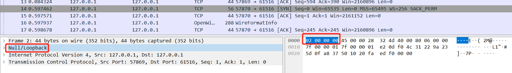
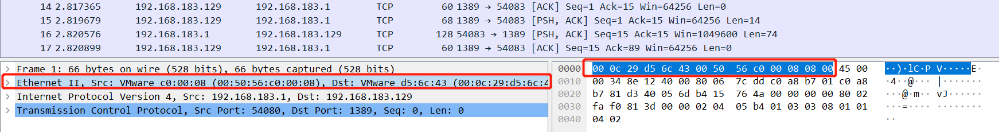
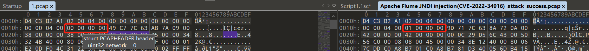
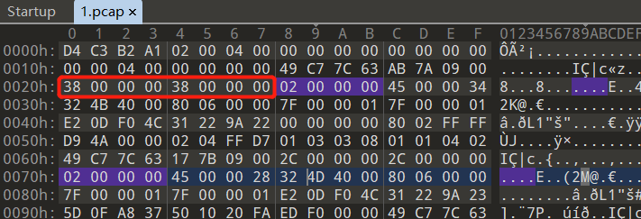
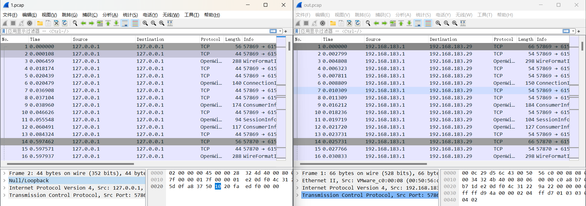

# 概述

​	在日常工作中会涉及到很多回放报文的需求，但是有时候由于各种原因，我们手上拿到的报文只有本地loopback的报文，这种报文在回放时不会被设备识别，所以遇到这种情况我们有两种方式解决：

- 针对HTTP请求，可以通过使用BurpSuite等工具将payload重发再次进行抓包
- 直接修改loopback报文

本文描述的是通过修改pcap文件的方式，将loopback包修改为正常通信报文。


# Loop Back报文与正常报文文件对比

最主要的区别有两处

- 其一是以太网头部的不同，这处的不同还导致了包长度的差异

  loopback报文的头部是`02 00 00 00`	

  而常规报文则是以太网头部以及IPv4标识

  

- 其二是loopback pcap文件的文件头中的Type Link为`00 00 00 00`，而常规pcap文件头中的Type Link为`01 00 00 00`


# Loop Back报文修改位置

1. 修改loopback的pcap文件头中的Type Link为`01 00 00 00`

2. 修改loopback报文中每个包的头部`02 00 00 00`为以太网头（源MAC + 目的MAC + type IPv4）

3. 由于上一步修改了loopback头为以太网头，所以会多出10字节的内容，需要修改Caplen和Len的值（hex表示需要 + a，在以太网头的前 4 + 4 的字节）

   如上面的`38 00 00 00 38 00 00 00`应改为`42 00 00 00 42 00 00 00`

4. 接下来修改IP即可，有需要的也可以改端口，不影响长度

> 注：由于pcap文件中的每个包都有其长度的标识，所以每个包都需要修改以太网头和长度值
>
> 可以用010Editor直接修改


# python脚本修改

## Demo

```python
from scapy.all import *
from scapy.layers.inet import IP, TCP
from scapy.layers.l2 import *


def gen_eth_pcap(pcap_obj, src_mac, dst_mac, file_path):
    """
    生成带二层头的新包
    :param pcap_obj: pcap文件对象
    :param src_mac: 需要设置的源MAC
    :param dst_mac: 需要设置的目的MAC
    :param file_path: 文件输出路径
    :return: None
    """
    eth_list = []
    for each_packet in pcap_obj:
        print(each_packet)
        eth = Ether(src=src_mac, dst=dst_mac)/IP()/TCP()
        eth['IP'] = each_packet['IP']
        eth['TCP'] = each_packet['TCP']
        print(eth)
        print("-------------------------------------------")
        # 写入pcap包
        eth_list.append(eth)

    wrpcap(file_path, eth_list)


def change_ip(pcap_obj, src_ip, dst_ip):
    """
    修改pcap包的原目的IP
    :param pcap_obj: pcap文件对象
    :param src_ip: 需要修改的源IP
    :param dst_ip: 需要修改的目的IP
    :return: 修改后的pcap对象
    """
    for each_packet in pcap_obj:
        each_packet['IP'].src = src_ip
        each_packet['IP'].dst = dst_ip

    return pcap_obj


def change_port(pcap_obj, src_port, dst_port):
    """
    修改pcap包的原目的端口
    :param pcap_obj: pcap文件对象
    :param src_port: 需要修改的源端口
    :param dst_port: 需要修改的目的端口
    :return: 修改后的pcap对象
    """
    for each_packet in pcap_obj:
        each_packet['TCP'].sport = int(src_port)
        each_packet['TCP'].dport = int(dst_port)

    return pcap_obj


def o(packets):
    for data in packets:
        s = repr(data)
        print(s)


if __name__ == "__main__":
    file_path_in = "./1.pcap"
    file_path_out = "./out.pcap"
    change_src_mac = "00:50:56:C0:00:08"
    change_dst_mac = "00:0C:29:D5:6C:43"
    change_src_ip = "192.168.183.1"
    change_dst_ip = "192.168.183.29"
    change_src_port = "54617"
    change_dst_port = "61516"

    pcap = rdpcap(file_path_in)

    # 先进行IP和端口的变换，因为不影响长度校验
    pcap = change_ip(pcap, change_src_ip, change_dst_ip)
    # pcap = change_port(pcap, change_src_port, change_dst_port)

    # 进行MAC地址转换
    # 此处用的方案是构建一个有二层头的包，将loopback的IP、TCP层之后放到新的包中
    gen_eth_pcap(pcap, change_src_mac, change_dst_mac, file_path_out)

```

## 说明

> 这里用的python的scapy插件对pcap文件进行操作，之前尝试使用过dpkt，结果发现不能满足要求，原因是dpkt识别pcap文件时会直接将每个数据包的前12个字节识别成源目的mac，这样会导致解析loopback报文时直接失败，而scapy则可以识别出loopback头部

原本是想用scapy将上述修改的地方全部做修改的，但是发现在修改pcap的Type Link和Loopback头部时还是难以修改，于是另辟蹊径：

1. 将原pcap包读入scapy的相应对象中（如TCP对象）
2. 修改这个对象的IP值127.0.0.1为我们想改的原目的IP
3. 重新构造一个TCP对象，且初始化时将我们想改的源目的MAC初始化到新对象中
4. 将原来的pcap报文对象的IP层数据和TCP层数据直接替换到新对象中
5. 将新对象写入新pcap

结果对比如下：




​		
